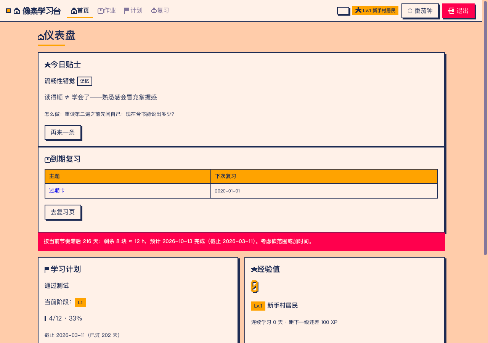
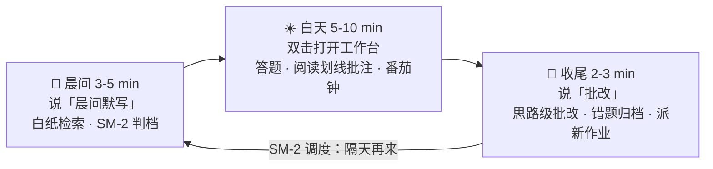
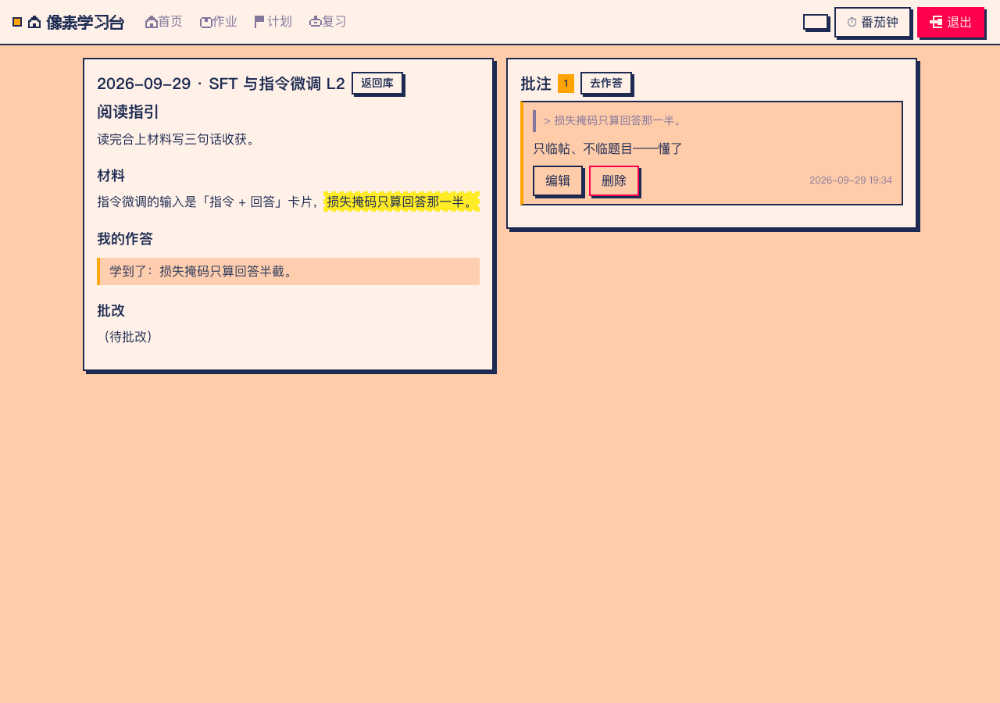
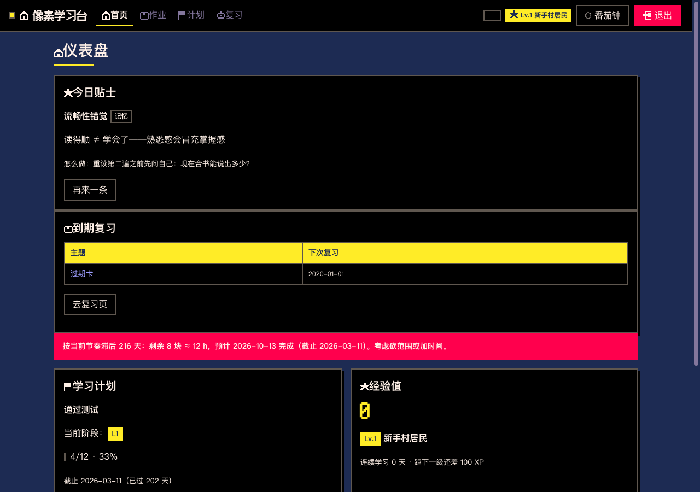

<div align="center">


# study-coach · AI 学习教练

**把学习科学变成每天 10 分钟的可执行循环**<br/>
AI 出题与批改 · 像素风本地工作台 · 间隔重复自动调度 · 进度全是 Markdown 文件

*An AI study-coach skill: spaced repetition & retrieval practice as a daily loop, with a pixel-art local workbench — all progress lives in plain Markdown.*




</div>

---

## 它解决什么问题

学过的东西三天就忘、错过的题换个马甲又错、「学过了」和「学会了」分不清——study-coach 把认知科学里真正有效的几件事（**检索练习、间隔重复、刻意练习、交错练习**）固化成 AI 教练可执行的日常流程，你只负责学，节奏交给系统。

## 一天长什么样



## 功能

| | |
|---|---|
| 🎯 **学习源接入** | 知识库 / PDF 论文 / 网页 / 代码仓，四类源统一材料化成笔记再进循环 |
| 📅 **期限倒排** | 「我想在 X 周内学会 Y」→ 块数预算 → 里程碑 → 滞后体检（`plan-check`） |
| ✍️ **晨间默写** | 到期卡发成「白纸包」，工作台白纸页一次一张默写：自动计时留痕（判档证据）、卡住 10 秒挣扎提示、草稿不丢；思路级批改（不是「哪步算错」，是「哪一步**想法**错了」） |
| 🔁 **SM-2 调度** | Anki 同源，四档评分，间隔 × 难易系数千人千卡，毕业自动出队 |
| 🧩 **错题变式** | 错题归档到思路级，只针对错的那个思路步出 2-3 道换皮变式题 |
| 📖 **阅读器 + 高亮批注** | 左材料右批注；选中文字→写批注→自动落 Obsidian 侧车笔记，高亮回显互跳 |
| 🍅 **番茄钟** | 25/5 计时，完成自动记进当天学习日志 |
| 🧠 **学习科学教学** | 批改时讲「为什么这么安排」（间隔效应/合意困难/交错练习），每日一条贴士，周复盘元学习三问 |

<div align="center"><em>阅读器与高亮批注</em>&nbsp;&nbsp;&nbsp;&nbsp;<em>深色主题</em></br>

</div>

> 像素风只做装饰（硬阴影、直角、阶梯进度条、PICO-8 配色），**正文一律系统可读字体**——好看，但不累眼。

## 快速开始

要求：Python 3（仅标准库）；Obsidian 可选（vault 即知识库目录）。

```bash
git clone https://github.com/dsspirit/study_coacher.git ~/.agents/skills/study-coach
# 像素点缀字体（可选，651KB；跳过则自动用系统字体）
~/.agents/skills/study-coach/scripts/fetch_pixel_font.sh
```

装好后对你的 AI 助手说：

1. 「**初始化学习工作台**」+ 指定学习文件夹（Obsidian vault 或任意目录）
2. 5 分钟**计划访谈**：总目标、截止、每周可投入几小时
3. 「我想在 X 前学会 Y」/「接入这个 PDF / 代码仓」→ AI 梳理材料、倒排期限

日常交互就几句话：`晨间默写` · `批改` · `出题拷问` · `今天复习什么` · `费曼日` · `周复盘` · `升级工作台`。

## 架构：文件即数据库

```
study-coach/
├── SKILL.md               # 教练工作流手册（AI 侧指令）
├── references/            # 细则：源接入 / 期限倒排 / 学习科学教学 / 视觉规范
├── assets/science_tips.md # 学习科学贴士库（50 条 · 8 领域）
├── scripts/
│   ├── scheduler.py            # SM-2 调度 CLI（due/add/advance/stats/plan-check）
│   ├── setup_learning_zone.py  # zone 初始化 / --upgrade 无损升级
│   └── fetch_pixel_font.sh     # 像素字体下载（可选）
├── app/                   # 工作台（Python stdlib + 原生 ES modules，零依赖零构建）
│   ├── learning_zone.py   # 入口薄壳（.command 双击的就是它）
│   ├── server.py          # JSON API + 静态文件（只监听 127.0.0.1）
│   ├── zonefs.py          # 文件协议：切题/状态机/批注/番茄钟/防穿越
│   ├── gamify.py          # XP/等级/连续天数（从已有文件纯计算，无缓存）
│   └── static/            # 像素风 SPA：仪表盘/作业/阅读器/计划/复习/番茄钟
└── tests/                 # unittest：协议回归 + 路径安全（23 项）
```

设计原则：**一切状态都在 Markdown 文件里**——复习队列是表格、作业是带 frontmatter 的笔记、批注是侧车笔记、XP 从已有文件纯计算。软件只是壳：删掉软件、换台电脑，进度都在。工作台写路径限死（三箱 + 学习批注 + 日志番茄钟节），只监听本机回环，作业包切题/写回有 23 项回归测试钉住。

## 学习科学依据

流程背后是对应的认知科学原理（完整口径见 `assets/science_tips.md`）：晨间默写=**测试效应**，隔夜重考=**间隔效应**，变式题换皮=**交错练习**，「感觉变差」被主动点破=**合意困难**，批改只收当天=**反馈时机**，睡前提醒 7.5h=**睡眠巩固**。贴士只收教科书级共识，不给打包票的数字。

## 许可

- 本项目代码：[MIT](LICENSE)
- 第三方：Fusion Pixel 字体（[OFL 1.1](app/static/fonts/OFL.txt)）、mermaid（MIT，本地 vendor）

## 致谢

方法框架来自使用者的《学习能力手册》，由 AI 教练（GLM on ZCode）协作设计实现。祝你学得又快又稳——**今晚睡够 7.5 小时，今天学的才算数**。🎯
